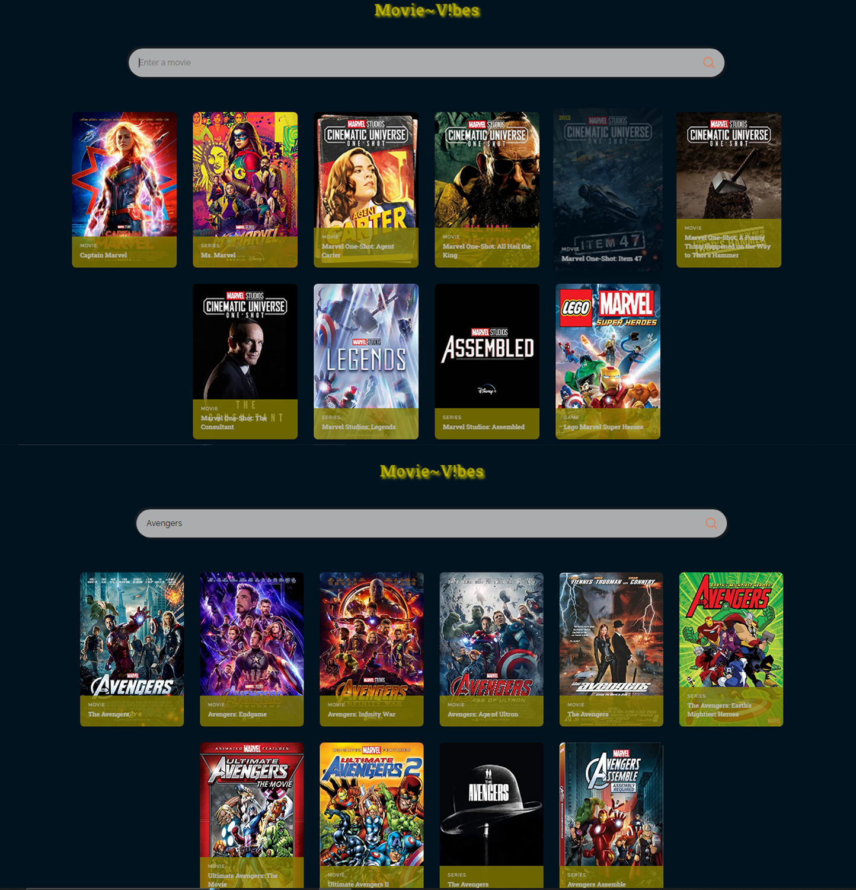

# MovieVibes

**MovieVibes** it's a movie web page created with React and the OMDB API. The page displays 
some specific movies by default and the searchbar allows you to search for other movies with the movie title.

## User Stories

The following functionalities are completed:

- [x] User can see specific related movies when first lauch.
- [x] User can search for movie in the search bar.
- [x] I movie not found, a message is displayed.

## Demo

Here's a demo of implemented user stories:

## Open-source libraries used

- [React](https://react.dev/)
- [Npm](https://www.npmjs.com/)

## Available Scripts

In the project directory, you can run:

### `npm start`

Runs the app in the development mode.\
Open [http://localhost:3000](http://localhost:3000) to view it in your browser.

The page will reload when you make changes.\
You may also see any lint errors in the console.

### `npm test`

Launches the test runner in the interactive watch mode.\
See the section about [running tests](https://facebook.github.io/create-react-app/docs/running-tests) for more information.

### `npm run build`

Builds the app for production to the `build` folder.\
It correctly bundles React in production mode and optimizes the build for the best performance.

